<!-- <center></center> -->

<style>
.back{
	position: fixed;
	width: 250px;
	height: 250px;
	top: 50%;
	left: 50%;
    margin-top: auto; 
    margin-left: auto; 
	opacity: 0.15;
    z-index: -1;
	}
</style>
<!--  -->


<center><u><h2> Two Way Switch </h1></u></center>


<center><h2> 1. Introduction </h2></center>

***
<h3> 1.1 What is a Two Way Switch ?</h3>

<p align="justify" class="main">A two way switch can be explained using a simple example. Consider a room with
two switches and one bulb. Now, If both the switches are in OFF state or ON state
the bulb will not glow. But, if either of the two switch is ON the bulb will glow.
If we have to relate this with digital electronics, the logic can be realised using an
X-OR gate.</p>

<h3> 1.2 X-OR Gate</h3>
XOR gate (pronounced as Exclusive OR) is a digital logic gate that gives a <b>TRUE</b>
(1 or HIGH) output when odd number of inputs are <b>TRUE.</b>

<p align="center">
  
</p>

<center>Figure 1: Symbol</center>
  
<p align="center">
  
</p>
<center>Figure 2: Truth Table</center>


<center><h2> 2. Circuit Diagram </h2></center>

***

> *__Note:__ LED does not conduct in both direction. This circuit is just a representation of the logic.*

<p align="center">
  
</p>
<center>Figure 3: Two way switch Circuit Diagram.</center><br />

<center><h2> 3. Code in Verilog </h2></center>

***
 
<h3> 3.1 Verilog Code(RTL Description)</h3>

<center><iframe id="ytplayer" type="text/html" width="640" height="360"
  src="https://www.youtube.com/embed/Z5gHCHcOVyE?autoplay=1&origin=http://example.com"
  frameborder="0"></iframe></center>

Dataflow Modelling:

```verilog
//Verilog code in Dataflow style
module TWS(
input s1,s2, //Define two Inputs pins
output z); //Define one output pin
assign z = (s1^s2); //XOR the 2 input pins(s1,s2) and assign

//the output to the output pin(X1)

endmodule
```

Behavioural Modelling:

```verilog
//Verilog code in Behavioural style
module TWS(
input s1,s2, //Define two inputs(switches)
output reg z //Define the output pin
);
always @ (s1,s2) //Every time the input changes, the output

//is to be updated

begin
if (s1==s2) //if both switches are in same position,

//output is LOW
z = 0;
else
z=1; //if the position of switches are not equal,
//output is HIGH

end
endmodule
```

<h3> 3.2 Testbench Code(Verilog)</h3>

```verilog
module TWS_tb;
reg s1;reg s2; //define input
wire z; //define output
TWS_Behavioural uut(.s1(s1),.s2(s2),.z(z)); //Map testbench ports with

//DUT ports

initial begin
s1 = 0; s2 = 0;#100; //different combinations of input
s1 = 0; s2 = 1;#100;
s1 = 1; s2 = 0;#100;
s1 = 1; s2 = 1;#100;
#100;
end
endmodule
```

<center><h2> 4. Implementing on Quartus</h2></center>

***
 

<p align="justify" class="main">To Implement the design in Quartus Software, follow these steps: (For more detailed information on the following steps, refer <b>Getting Started with Quartus</b> section from Task 0)</p>

> *__Note:__ For this demonstration, the language used is Verilog HDL.*<br />

<b>Family:</b> Cyclone IV E; <b>Chip Name:</b> EP4CE22F17C6

<ol>
<li> Start a new project in Quartus Lite software</li>

<p align="center">
  
</p>


<li><p align="justify" class="main">Create a new Verilog or VHDL file.Here we create a Verilog file for demonstration. Same procedure can be followed to VHDL file.</p></li>

<p align="center">
  
</p>

<li><p align="justify" class="main">Type the above main code in this file and make sure that the Module name
and the file name is same.</p></li>

> *__Note:__ We have used the Dataflow Verilog code for this demonstration.*

<p align="center">
  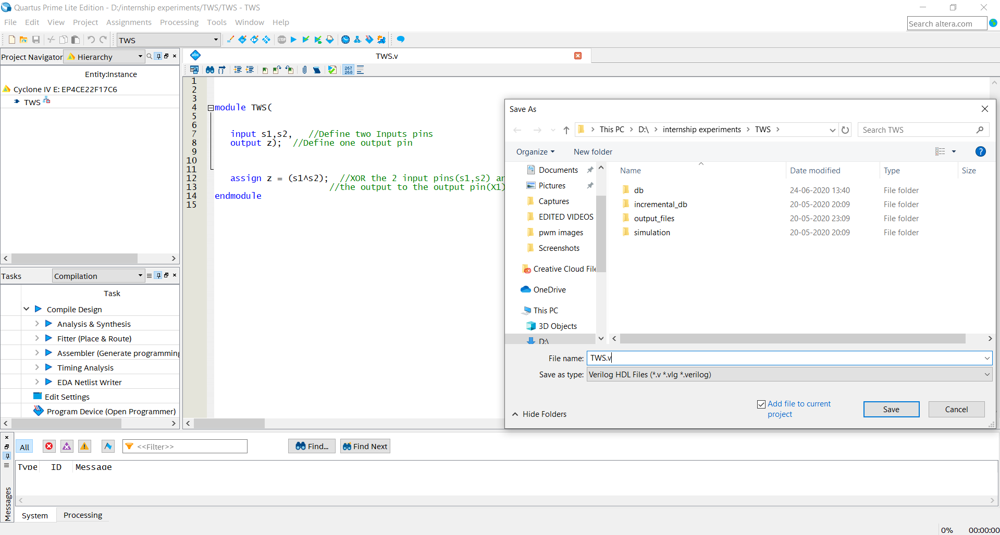
</p>


<li> Go to <b>Project → Set as Top-Level Entity</b>.</li>

<p align="center">
  
</p>


<li>Go to <b>Processing → Start Compilation</b>.</li>

<p align="center">
  
</p>


<li>After successful compilation, you will see these Green check marks.</li>

<p align="center">
  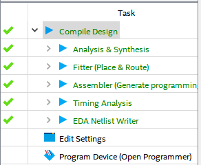
</p>

</ol>

<center><h2> 5. RTL Circuit of the implemented design </h2></center>

***


<p align="justify" class="main">The below two figures show the RTL Circuit of the two different types of modelling (Dataflow and behavioural). As it can be seen, both types of modelling resulted
in the same type of design. Although might not be true for more complex designs (Behavioural modelling results in a more complex circuit than Dataflow or
Structural), intelligent and smart behavioural design can lead to really well optimised circuits.</p>

<b>Steps to get RTL circuit.</b>

<ol>
<li> Go to <b>Tools → Netlist Viewers → RTL Viewer</b>.</li>

<p align="center">
  
</p>


<li> The below figure shows the equivalent RTL circuit in both Dataflow and Behavioural modelling styles.</li>

<p align="center">
  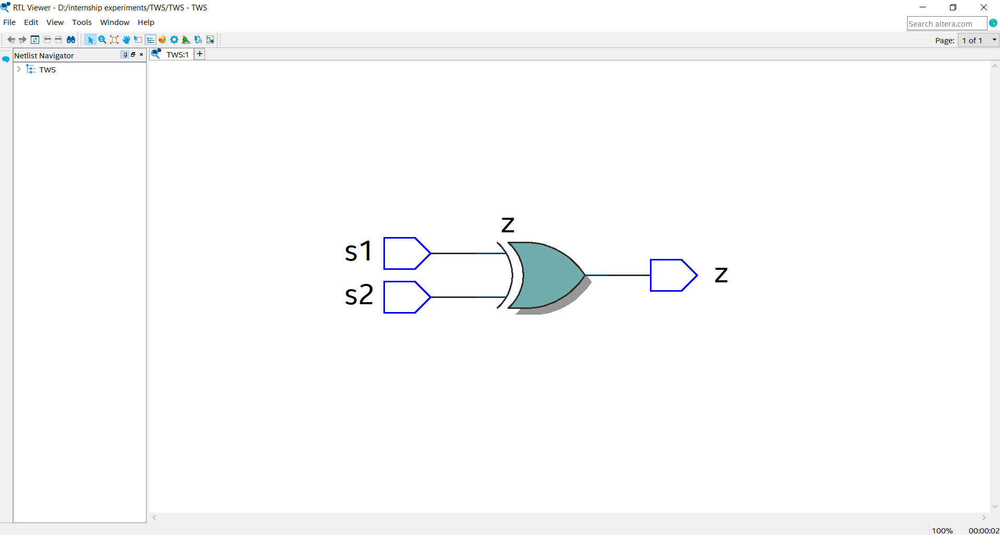
</p>
<center>Figure 4: Dataflow modelling</center><br />

<p align="center">
  
</p>
<center>Figure 5: Behavioural modelling</center><br />

<ol>

<center><h2> 6. Implementing on Modelsim </h2></center>

***


<p align="justify" class="main">The TestBench shown here is a Verilog TestBench. For more detailed procedure on using ModelSim, Refer <b>Getting Started with Quartus</b> section from Task 0.</p>

<ol>
<li> <p align="justify" class="main">Create a <b>NEW</b> Verilog  file in Quartus&nbsp; Prime. Type in the TestBench code
provided in this document and <b>SAVE</b> the file with the same name as the
module name.</p></li>

<p align="center">
  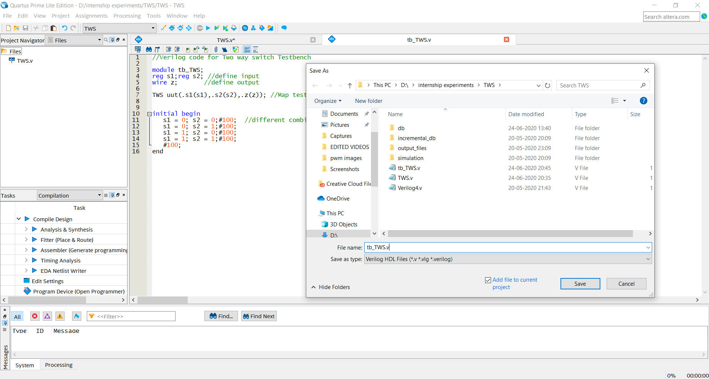
</p>


<li>Go to <b>Assignments→Settings</b>.</li>

<p align="center">
  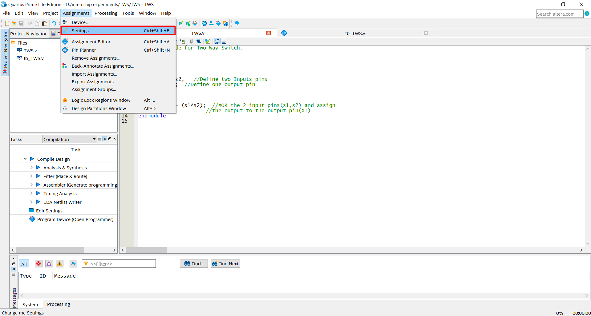
</p>


<li><p align="justify" class="main"> Navigate  to <b>Simulation</b> under <b>EDA Tool Settings</b>. Set the language as
Verilog HDL.  Select <b>Compile Test Bench</b> and then click on <b>Test Benches</b>.</p></li>

<p align="center">
  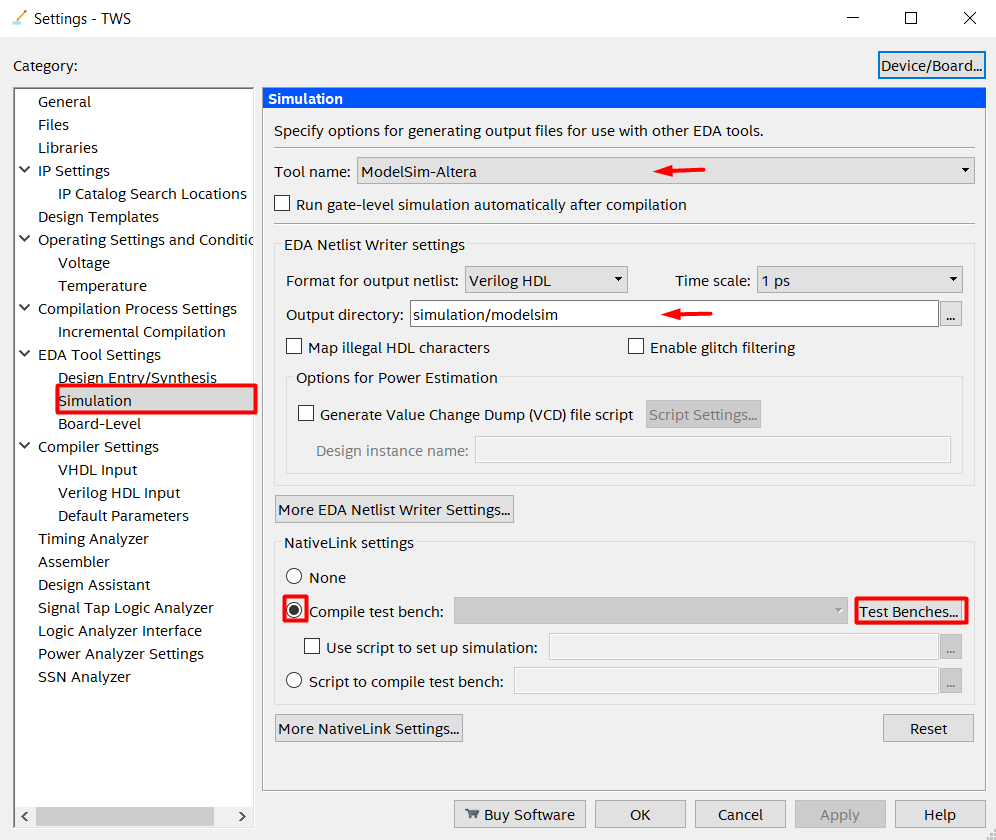
</p>


<li>Click on <b>New</b>, this opens another dialogue box.</li>

<p align="center">
  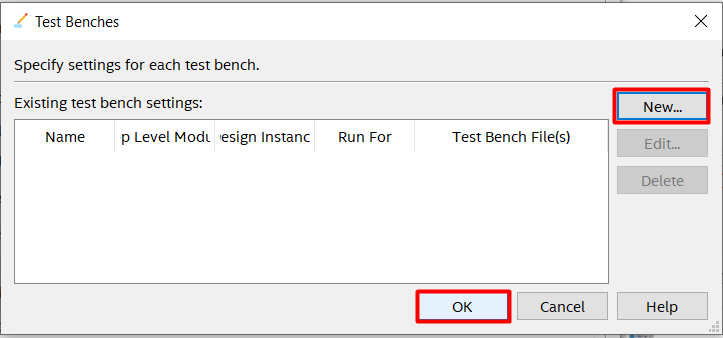
</p>


<li><p align="justify" class="main">Now type in the testbench name(In this design , its <b>tb_TWS</b>). Now click on
the highlighted browse button. Find the testbench file(it can be found in the
project directory) and  click on <b>Open</b>. Now click on <b>Add</b>,then <b>OK</b>.</p></li>

<p align="center">
  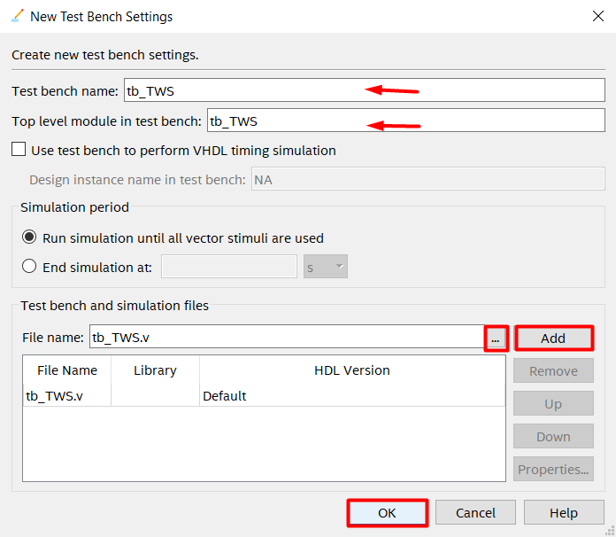
</p>

</ol>

<b>Functional Simulation using NativeLink Feature</b>
<ol>
<li><p align="justify" class="main">Go to menu <b>Processing → Start → Start Analysis & Elaboration</b>. After
this click on <b>Start Analysis & Synthesis</b> on the same drop box.</p></li>

<p align="center">
  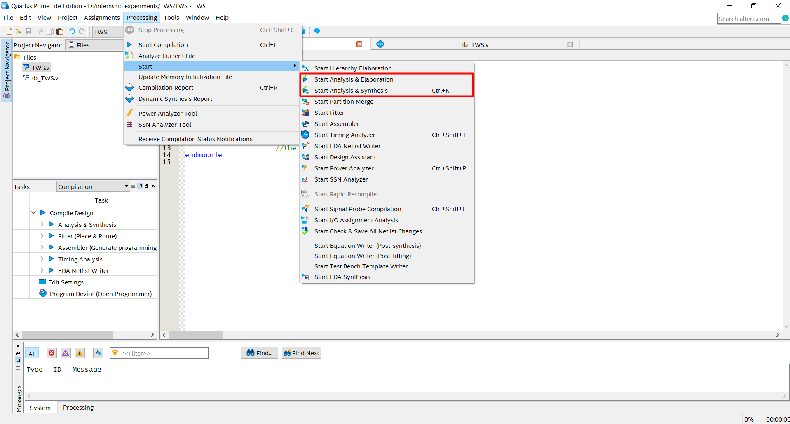
</p>


<li><p align="justify" class="main">Go to menu <b>Tools → Run Simulation Tool → RTL Simulation</b> to
automatically run the EDA simulator(ModelSim-Altera) and to compile all
necessary design files.</p></li>

<p align="center">
  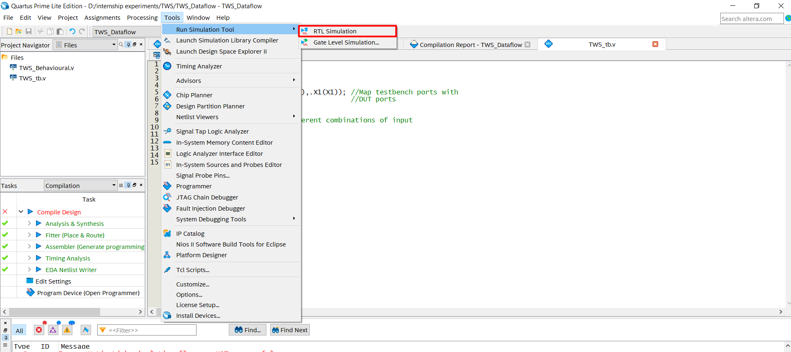
</p>


<li><p align="justify" class="main">Finally ModelSim-Altera tool  opens up with simulated waveform. click on
<b>Run all</b> icon on the tool box to display the waveform.</p></li>
</ol>


<center><h2> 7. Testing the Design </h2></center>

---

<p align="justify" class="main">
What you see below is the simulation&nbsp; waveform obtained in ModelSim. Consider
the Verilog design, from the waveform, we can see that when <b>s1 = 0</b> and <b>s2 = 0</b>
the output <b>z = 0</b>. When <b>s1 = 0</b> and <b>s2 = 1</b> the output <b>z = 1</b>. When <b>s1 = 1</b> and <b>s2 = 0</b> the output 
<b>z = 1</b>. When <b>s1 = 1</b> and <b>s2 = 1</b> the output <b>z= 0</b>. This is the logic of a XOR Gate. The same can be observed in the VHDL
design.Hence the design has been verified.</p>

<h3> 7.1 Simulation waveform of the Verilog Design </h3>

<p align="center">
  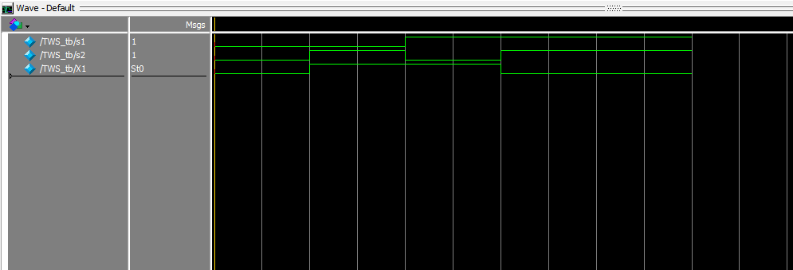
</p>


