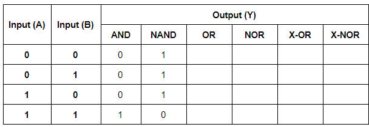
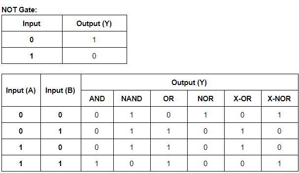
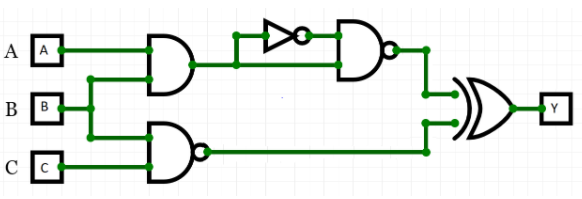

<!-- 

 -->

<!--  -->

<h2>Basics of Digital Electronics</h2>

In this section you will learn the basics of Digital Circuits. 

Let us start with the Binary number system.

Ever wondered how the computer understands your program written in ‘C’ or ’python’ or any other language? 
Well it does not understand these languages. It only understands the machine language or binary logic. It is the compiler that converts your 
program into the machine language which the computer understands. This language contains only 2 elements ‘0’ and ‘1’, which form a number 
system called the binary number system. Hence, as a digital circuit designer, it is important for us to understand this number system.

<b>Binary Number system :</b> As said earlier, it is a number system consisting of only two numbers 0 and 1. So how do we represent 2? The same way we have 0-9 in the decimal system and we represent 10 as ‘ten’ in the decimal system. 

<b>Operations in binary number system :</b> Refer this <u><a href="https://learn.circuitverse.org/docs/binary-algebra/" target="_blank">link</a></u> for operations in Binary number system.
 

<b>So how are the binary numbers used in digital circuits?</b> 

In digital circuits, the voltage levels are represented by a binary 1 (for high voltage) and 0 (for low voltage). Refer the 
following sections at this <u><a href="https://www.allaboutcircuits.com/textbook/digital/chpt-3/logic-signal-voltage-levels/ " target="_blank">link</a></u> 
to understand more :

<ul>
<li>Voltage Tolerance of TTL Gate Inputs</li>
<li>Voltage Tolerance of CMOS Gate Inputs</li>
</ul>

Let us now learn about logic gates in digital circuits.

<b>Logic gates are electronic devices that perform logical operations on input signals. Following is the list of logic gates :</b>

<ul>
<li>NOT</li>
<li>AND</li>
<li>NAND</li>
<li>OR</li>
<li>NOR</li>
<li>X-OR</li>
<li>X-NOR</li>
</ul>

Check the video below to understand the working of NOT, AND and NAND gates.

<iframe id="ytplayer" type="text/html" width="640" height="360"
  src="https://www.youtube.com/embed/KGl64gyuACs?autoplay=1&origin=http://example.com"
  frameborder="0"></iframe>

Now that you have understood how to create Truth tables for NOT, AND and NAND, can you complete Truth Table below for the remaining gates?
 

  

You can use the circuitverse link below to complete the Truth Table.

<iframe width="600px" height="400px" src="https://circuitverse.org/simulator/embed/logic-gates-535129d7-c738-414e-8a54-7e40086b7a6b" id="projectPreview" scrolling="no" webkitAllowFullScreen mozAllowFullScreen allowFullScreen></iframe>

Confirm that the truth table for the gates is as below:

  

If your truth table does not match the above truth table, check the circuit and deduce the truth table again.

Simple hack to remember the truth table of the above logic gates:
<ul>
<li>NOT  : Gives opposite of input</li>
<li>AND  : Output is ‘1’ only if all inputs are ‘1’, else ‘0’</li>
<li>NAND : Opposite of AND</li></li>
<li>OR   : Output is ‘1’ if any of the inputs is ‘1’</li>
<li>NOR  : Opposite of OR</li>
<li>X-OR : Output is ‘1’ if there are odd number of input ‘1’</li>
<li>X-NOR: Opposite of X-OR</li>
</ul>

Now that you know how to deduce the truth table for basic gates, here is a self learning activity.
 

Consider the circuit below. Convert the numbers in your eYRC team ID into Binary and consider the lowest three bits as the input to the circuit. For example, if your team ID is 502, binary is ‘111110110’ and the lowest three bits for input become A=1, B=1 and C=0. Now deduce the outcome ‘Y’ for the circuit for the respective inputs using your team ID.

  

 

> *__Note:__ This is a self learning activity and we expect you to honestly deduce the output for your inputs. You are free to refer to any resources. Once you have deduced the output, refer to the truth table at this <u><a href="https://docs.google.com/document/d/1H-i4tXCxkCBNDhYj9GnqmqaxfLFcCDpsrBAhMMBkMbY/edit?usp=sharing" target="_blank">link</a></u> to confirm your output is correct. If not, work on the circuit again.*

We will now study more combinational digital circuits.
Watch the video below that explains the working of Half Adder.

<iframe id="ytplayer" type="text/html" width="640" height="360"
  src="https://www.youtube.com/embed/gGbmLotvN40?autoplay=1&origin=http://example.com"
  frameborder="0"></iframe>

  

Now use the circuit below and the internet to understand the working of Full Adder, Multiplexer and Demultiplexer.

<iframe width="600px" height="400px" src="https://circuitverse.org/simulator/embed/combinational-digital-logic" id="projectPreview" scrolling="no" webkitAllowFullScreen mozAllowFullScreen allowFullScreen></iframe>

The circuits discussed till now can be categorized into combinational logic circuits. In these types of circuits, the output of the circuit depends only on present input and does not depend on previous outputs. Contrary, the other category of digital circuits is sequential logic circuits where the output depends on current input, as well as, previous output.

Watch the video below:

<iframe id="ytplayer" type="text/html" width="640" height="360"
  src="https://www.youtube.com/embed/Sm27ULM5uqA?autoplay=1&origin=http://example.com"
  frameborder="0"></iframe>

Now that you know the basics of latches and flip-flops, deduce the state table for various flip-flops listed below.

S	| R	  | Q(t+1) |
--- |---- |------- |
0   |  0  |        |
0   |  1  |        |
1   |  0  |        |
1   |  1  |        |

SR flipflop

 

J	| K	  | Q(t+1) |
--- |---- |------- |
0   |  0  |        |
0   |  1  |        |
1   |  0  |        |
1   |  1  |        |

JK flipflop

 

You can use the circuitverse link below to complete the state table.

<iframe width="600px" height="400px" src="https://circuitverse.org/simulator/embed/sequential-digital-logic" id="projectPreview" scrolling="no" webkitAllowFullScreen mozAllowFullScreen allowFullScreen></iframe>

Confirm that the state table is as below:

D	  | Q(t+1)|
----- |------ |
0     |  0    | 
1     |  1    | 

D flipflop

 

T	  | Q(t+1)|
----- |------ |
0     |  Q(t) | 
1     |  Q(t)'| 

T flipflop

 

S	| R	  | Q(t+1) |
--- |---- |------- |
0   |  0  |  Q(t)  |
0   |  1  |   0    |
1   |  0  |   1    |
1   |  1  |   -    |

SR flipflop

 

J	| K	  | Q(t+1) |
--- |---- |------- |
0   |  0  |  Q(t)  |
0   |  1  |   0    |
1   |  0  |   1    |
1   |  1  |  Q(t)’ |

JK flipflop

 
With this we have completed the basics of digital logic circuits. 

