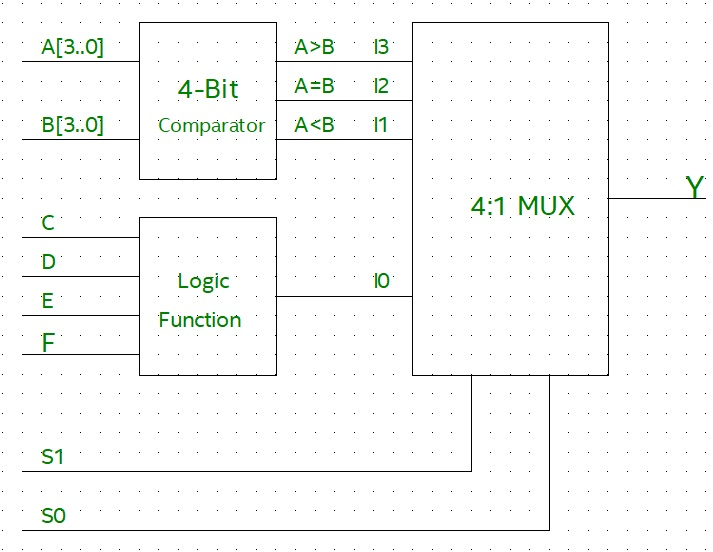
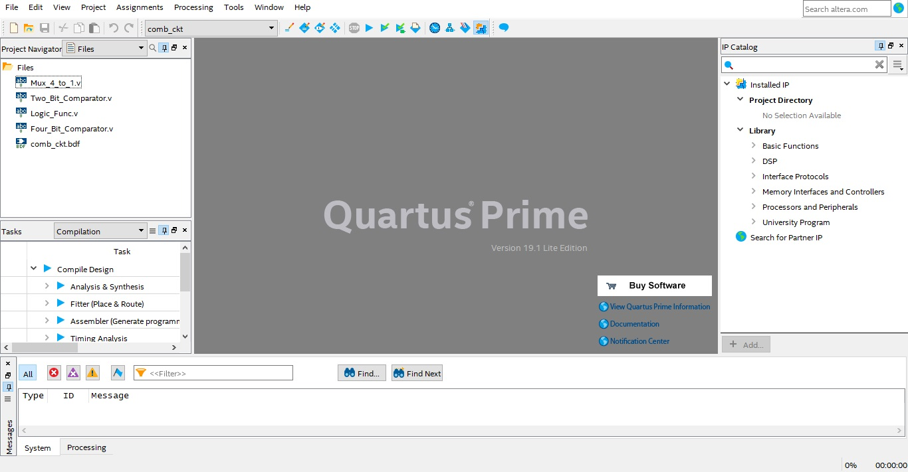
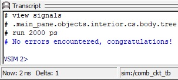
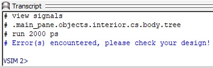

<!-- <center></center> -->

<style>
.back{
	position: fixed;
	width: 250px;
	height: 250px;
	top: 50%;
	left: 50%;
    margin-top: auto; 
    margin-left: auto; 
	opacity: 0.15;
    z-index: -1;
	}
</style>
<!--  -->


<center><h1>Task 1 A : Combinational Circuit</h1></center>

<hr>
<b>Problem Statement :</b> Design a combinational circuit using 4-bit comparator, 4 input logic function and 4:1 multiplexer. Minterms for logic function are f(C,D,E,F) = Σm(0,1,6,7,8,11,12,15).
<hr>

<b>Description :</b><div align="justify" class="main"> <a name = "Resources"></a> In this task you will be designing a combinational circuit consisting of a 4-bit comparator, 4 input logic function and 4:1 multiplexer. The 4-bit comparator is designed using a 2-bit comparator. The minterms for the logic function are f(C,D,E,F) = Σm(0,1,6,7,8,11,12,15), so whenever any of these minterms occur, output of the 4-input logic function becomes HIGH. A 4:1 multiplexer is used to select output of either 4-bit comparator or 4-input logic function as shown below.</div>

<p align="center">
  
</p> 

> *__Note__ : You are only allowed to modify the code/ block diagram wherever it is mentioned to do so. Modifying the restricted blocks of code/ block diagram will result in Zero Marks and/ or disqualification from the competition.*  


<hr>
Project File : <u><a href="./project_files/comb_ckt.zip" download>Download TASK 1 A</a></u>
<hr>

<b>Resources :</b> <a name = "Resources1">
<ul>
<li><u><a href="../task_0/getting_started.md" target="_blank">Getting Started with Quartus</a></u></li>
<li><u><a href="https://www.chipverify.com/verilog/verilog-tutorial" target="_blank">Verilog tutorials</a></u></li>
<li><u><a href="https://www.geeksforgeeks.org/magnitude-comparator-in-digital-logic/" target="_blank">Magnitude Comparator</a></u></li>
<li><u><a href="https://www.geeksforgeeks.org/multiplexers-in-digital-logic/" target="_blank">Multiplexer</a></u></li>
<li><u><a href="https://www.geeksforgeeks.org/minimization-of-boolean-functions/" target="_blank">Minimization of logic function</a></u></li>
<li>Converting Verilog file to Block Diagram</li><br>
<center><iframe id="ytplayer" type="text/html" width="640" height="360"  src="https://www.youtube.com/embed/wBThTwBCkP4?autoplay=1&origin=http://example.com"  frameborder="0"></iframe></center>
</ul>

***

<b>Steps :</b>  

<ol>
<li><p align="justify" class="main">Open <b>comb_ckt.qpf</b> (Quartus Prime Project File) located in the comb_ckt folder. Quartus Prime might take some time to load depending on the configuration of your PC. Once the project file is opened in Quartus Prime your Quartus window will look like the image shown below :</p><a name = "SD"></a></li>

     

<li><p align="justify" class="main">On the top left corner “Project Navigator” window shows the compilation <b>Hierarchy</b> of the project. Click on the dropdown menu and select <b>Files</b> view as shown in the image below.</p></li><br />

  

<p align="center">
  
</p>  

<li><p align="justify" class="main">You will find 5 files already present in the project folder : 
Mux_4_to_1.v (Verilog HDL file), Two_Bit_Comparator.v, Four_Bit_Comparator.v, Logic_Func.v, comb_ckt.bdf (Block Design File).</p> </li>

> *__Note__ : These five files are pre added to the project by e-Yantra team.*  

<li><p align="justify" class="main">The first file is Two_Bit_Comparator.v (Verilog HDL file). Double click on it to edit. You’ll find prewritten code where the module is defined. Edit this file to design a 2-bit comparator but do not make any changes to the module declaration. <b>Teams are not allowed to use predefined operators like ">", "<", "=" for comparison.</b></p></li>

> *__Note__ :To verify 2-bit comparator design, you can use <b>University Program VWF</b> method (refer Task 0).*  

<li><p align="justify" class="main">After designing a 2-bit comparator, you can edit the Four_Bit_Comparator.v file to design a 4-bit comparator. Again, do not make any changes to the module declaration. This 4-bit comparator is designed by <b>instantiating the Two_Bit_Comparator</b> design (which is created earlier) <b>in Four_Bit_Comparator.v</b> and teams are <b>not allowed to use</b> predefined operators like <b>">", "<", "="</b> for comparison.</p></li>

> *__Note__ : Refer to this [link](https://www.chipverify.com/verilog/verilog-modules) to understand module instantiation.*


<li><p align="justify" class="main">Now that you have designed a 4-bit comparator, you can start editing Logic_Func.v file to design a 4-input logic function f(C,D,E,F) = Σm(0,1,6,7,8,11,12,15). Here C is MSB and F is LSB. Refer to <u><a href="https://www.geeksforgeeks.org/minimization-of-boolean-functions/" target="_blank">Minimization of logic function</a></u> resource to efficiently design the logic function.</p></li>


<li><p align="justify" class="main">Finally, design a 4:1 Multiplexer by editing Mux_4_to_1.v file. Inputs are I3(MSB), I2, I1, I0(LSB) and also two Select inputs S1(MSB), S0(LSB).</b> </p> </li>


<li><p align="justify" class="main">Once all the designs are successfully created, create a Symbol file for Mux_4_to_1.v, Four_Bit_Comparator.v and Logic_Func.v.</li> 

> *__Note__ : Refer : [Converting Verilog file to Block Diagram](https://youtu.be/wBThTwBCkP4).*

<li><p align="justify" class="main">Now open <b>comb_ckt.bdf</b> (Block Design File) to create the final combinational circuit. In the comb_ckt.bdf file Inputs and Outputs are predefined, do not make any changes to these PORTS. Refer above block diagram for creating the combinational circuit. Properly add all the symbols which are created earlier and make correct connections between them.</b></p></li>


<li><p align="justify" class="main">Now, Generate Verilog HDL file from comb_ckt.bdf file. To do so, while comb_ckt.bdf is open click on <b>File > Create/ Update > Create HDL Design File From Current File > Select Verilog HDL > OK.</b> </p> </li>

> *__Note__ : Generate Verilog HDL file after completing the whole design. If you change anything in the block diagram file you have to again create a Verilog HDL file.*

<li><p align="justify" class="main">Now comb_ckt.v is created and you can find this file in the comb_ckt folder in Windows File Manager. Rename this file to <b>comb_ckt_verilog.v</b></p> </li>

<li><p align="justify" class="main">We need to add this file to our project. Right Click on the <b>Files</b> symbol under <b>Project Navigator > Add/ Remove Files in Project > Click on 3 dots > Select comb_ckt_verilog.v file > Open > Apply > OK.</b> </p> </li>

<li><p align="justify" class="main">Double click on the file added in the previous step. Now change the module name. Module name should be the same as file name i.e. <b>comb_ckt_verilog. Do not make any other changes.</b></p> </li>

<b>Before :</b>

```verilog
module comb_ckt(
	C,
	D,
	E,
	F,
	S1,
	S0,
	A,
	B,
	Y
);
```

<b>After :</b>
```verilog
module comb_ckt_verilog(
	C,
	D,
	E,
	F,
	S1,
	S0,
	A,
	B,
	Y
);

```
<a name = "SD13"></a>

> *__Note__ : Follow the steps correctly and make sure that file/module names are exactly as described in above steps. Slight mistakes might lead to compilation errors.*  


<li><p align="justify" class="main">Now the next step is to make the <b>comb_ckt_verilog.v</b> file as <b>Top-Level Entity</b>. <b>Right click</b> on the comb_ckt_verilog.v file > <b>Set as Top-Level Entity</b>.</p></li>

<li><p align="justify" class="main">Compile your design : <b>Processing > Start Compilation</b>. Finally Run the RTL simulation. <b>Tools > Run Simulation Tool > RTL Simulation</b>. A new window will pop up after a few seconds and you will be able to see the results of your design in <b>ModelSim</b> Software. If your design is correct then you will see <b>Congratulations</b> message in the transcript (bottom section of ModelSim).</li>

	
<p align="center">
  
</p> 

Else you will see an <b>Error</b> message in the transcript.   

<p align="center">
  
</p> 

    

You can also check waveforms and verify/debug your design.  


When <b>Output (Y)</b> and <b>Expected Output (exp_out)</b> match, there will be no errors in the design.

> *__Note__ : If you are not able to see waveform, you can right click and select <b>zoom in/zoom out/zoom full</b> as shown in the above figure.*


</ul>
<br />

<p align=center><b>…BestWishes!…</b></p>