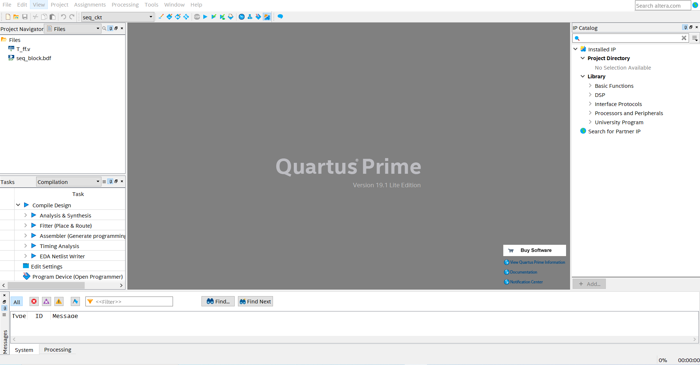
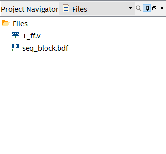
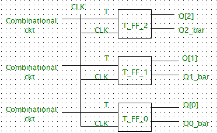
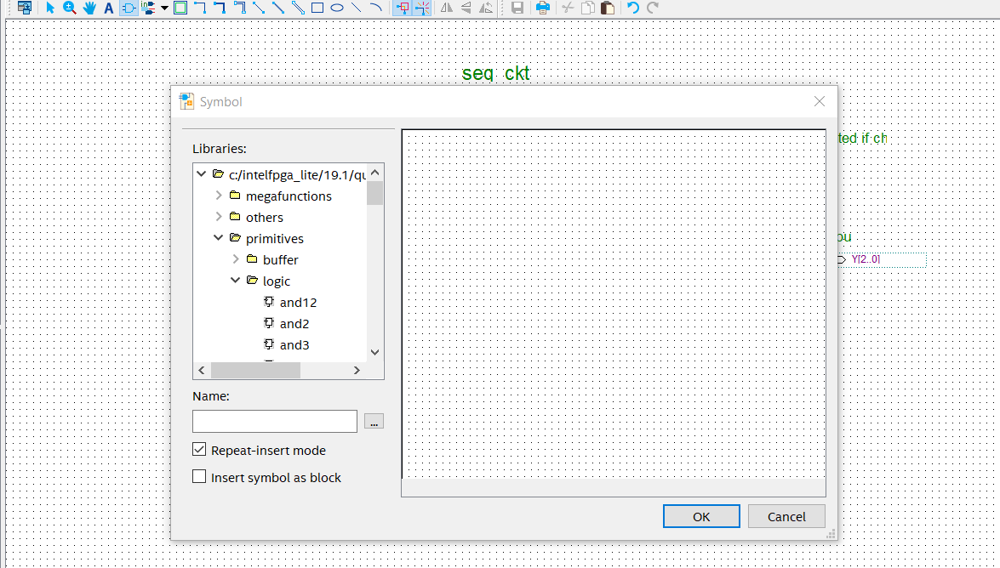
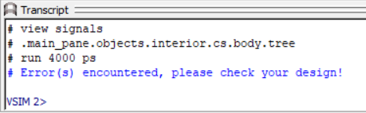
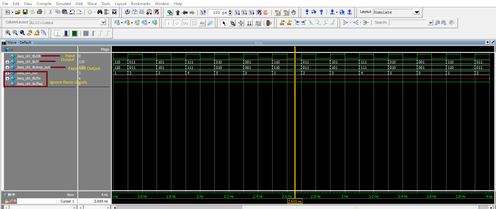

<!-- <center></center> -->

<style>
.back{
	position: fixed;
	width: 250px;
	height: 250px;
	top: 50%;
	left: 50%;
    margin-top: auto; 
    margin-left: auto; 
	opacity: 0.15;
    z-index: -1;
	}
</style>
<!--  -->


<center><h1>Task 1 B : Sequential Circuit</h1></center>

<hr>
<b>Problem Statement :</b> Design a 3-bit synchronous counter for sequence : <b>6➡3➡5➡7➡2➡1</b>, using <b>T flip-flops</b>. The unused states are 0 & 4.
<hr>

<b>Description :</b><div align="justify" class="main"> <a name = "Resources"></a> In this task you will be designing a 3-bit synchronous counter for the count sequence 6➡3➡5➡7➡2➡1➡6. This counter is designed using T Flip Flops and these are <b>positive edge triggered</b> Flip Flops. So, the count sequence is changed on the positive edge of the clock. For this 3-bit counter, 0 and 4 are the unused states. Whenever these states (0 or 4) are encountered, the counter should go to 6 and start counting.</div>


> *__Note__ : You are only allowed to modify the code/ block diagram wherever it is mentioned to do so. Modifying the restricted blocks of code/ block diagram will result in Zero Marks and/ or disqualification from the competition.*  


<hr>
Project File : <u><a href="./project_files/seq_ckt.zip" download>Download TASK 1 B</a></u>
<hr>

<b>Resources :</b> <a name = "Resources1">
<ul>
<li><u><a href="https://www.javatpoint.com/t-flip-flop-in-digital-electronics" target="_blank">T Flip Flop</a></u></li>
<li><u><a href="https://www.tutorialspoint.com/digital_circuits/digital_circuits_counters.htm" target="_blank">Counters</a></u></li>
<li><u><a href="https://www.geeksforgeeks.org/self-starting-counter/" target="_blank">Self Starting Counter</a></u></li>
<li><u><a href="https://community.intel.com/t5/Intel-Quartus-Prime-Software/How-do-I-split-a-bus-into-individual-signal-lines/td-p/168437" target="_blank">Create 3-bit bus from each OUTPUT pin Q of T Flip Flop</a></u></li>
<li>Converting Verilog file to Block Diagram</li><br>
<center><iframe id="ytplayer" type="text/html" width="640" height="360"  src="https://www.youtube.com/embed/wBThTwBCkP4?autoplay=1&origin=http://example.com"  frameborder="0"></iframe></center>
</ul>

***

<b>Steps :</b>  

<ol>
<li><p align="justify" class="main">Open <b>seq_ckt.qpf</b> (Quartus Prime Project File) located in the seq_ckt folder. Quartus Prime might take some time to load depending on the configuration of your PC. Once the project file is opened in Quartus Prime your Quartus window will look like the image shown below :</p><a name = "SD"></a></li>

     

<li><p align="justify" class="main">On the top left corner “Project Navigator” window shows the compilation <b>Hierarchy</b> of the project. Click on the dropdown menu and select <b>Files</b> view as shown in the image below.</p></li><br />

  

<p align="center">
  
</p>  

<li><p align="justify" class="main">You will find 2 files already present in the project folder : 
T_ff.v (Verilog HDL file) and seq_block.bdf (Block Design File).</p> </li>

> *__Note__ : These two files are pre added to the project by e-Yantra team.*  

<li><p align="justify" class="main">The first file is T_ff.v (Verilog HDL file). Double click on it to edit. You’ll find prewritten code where the module is defined. Edit this file to design a T Flip Flop which is <b>positive edge triggered</b>. Do not make any changes to the module declaration.</p></li>

> *__Note__ :To verify T Flip Flop design, you can use <b>University Program VWF</b> method (refer Task 0).*  

<li><p align="justify" class="main">Once design is successfully created, create a Symbol file for T Flip Flop.</p></li>


<li><p align="justify" class="main">Now open <b>seq_block.bdf</b> (Block Design File) to create a synchronous counter for the given sequence. In the seq_block.bdf file Inputs and Outputs are predefined, do not make any changes to these PORTS. Refer below image to design 3-bit synchronous counter using T Flip Flops.</p></li>

<p align="center">
  
</p>

<li><p align="justify" class="main">We will add the symbols of T Flip Flop created previously and connect the CLK pin of each Flip Flop to the predefined Input Clock PORT. </p> </li>


<li><p align="justify" class="main">In the above image, you can see that the T input pin of each T Flip Flop is connected to some combinational circuit. You are required to design these circuits for the required count sequence.</li> 

> *__IMP__ : When designing the counter, make sure to include the unused states (0 and 4) in the design. Whenever 0 or 4 are encountered, the next state of the counter should be 6. So, (0 or 4)➡6➡3➡5➡7➡2➡1➡6➡3➡5➡7➡2➡1➡6.*

<li><p align="justify" class="main">You can use logic gate symbols available in Quartus to create combinational circuits. Click on <b>Symbol Tool > primitives > logic</b> as shown below.</p></li>

<p align="center">
  
</p>

<li><p align="justify" class="main">Finally, connect all the 3 outputs of T FLIP FLOP to the 3-bit predefined bus using Orthogonal Bus Tool. Refer to the Resources section. </p> </li>

> *__Note__ : Before proceeding further, make sure that the instance names (Eg: inst, inst1,...) of each symbol in the block diagram file are different from each other or else it would throw an error.*

<li><p align="justify" class="main">Once all the connections are successfully done, generate the Verilog HDL file from the seq_block.bdf file. To do so, while seq_block.bdf is open click on <b>File > Create/ Update > Create HDL Design File From Current File > Select Verilog HDL > OK.</b></p> </li>

> *__Note__ : Generate Verilog HDL file after completing the whole design. If you change anything in the block diagram file you have to again create a Verilog HDL file.*

<li><p align="justify" class="main">Now seq_block.v is created and you can find this file in the seq_ckt folder in Windows File Manager. Rename this file to <b>seq_block_verilog.v</b></p> </li>

<li><p align="justify" class="main">We need to add this file to our project. Right Click on the <b>Files</b> symbol under <b>Project Navigator > Add/ Remove Files in Project > Click on 3 dots > Select seq_block_verilog.v file > Open > Apply > OK.</b></p> </li>

<li><p align="justify" class="main">Double click on the file added in the previous step. Now change the module name. Module name should be the same as file name i.e. <b>seq_block_verilog. Do not make any other changes.</b></p> </li>

<b>Before :</b>

```verilog
module seq_block(
  CLK,
  Y
);
```

<b>After :</b>
```verilog
module seq_block_verilog(
  CLK,
  Y
);
```
<a name = "SD13"></a>

> *__Note__ : Follow the steps correctly and make sure that file/module names are exactly as described in above steps. Slight mistakes might lead to compilation errors.*  


<li><p align="justify" class="main">Now the next step is to make the seq_block_verilog.v file as <b>Top-Level Entity</b>. <b>Right click on the seq_block_verilog.v file > Set as Top-Level Entity.</b></p></li>

<li><p align="justify" class="main">Compile your design : <b>Processing > Start Compilation</b>. Finally Run the RTL simulation. <b>Tools > Run Simulation Tool > RTL Simulation</b>. A new window will pop up after a few seconds and you will be able to see the results of your design in <b>ModelSim</b> Software. If your design is correct then you will see <b>Congratulations</b> message in the transcript (bottom section of ModelSim).</li>

	
<p align="center">
  
</p> 

Else you will see an <b>Error</b> message in the transcript.   

<p align="center">
  
</p> 

    

You can also check waveforms and verify/debug your design.  



When <b>Output (Y)</b> and <b>Expected Output (exp_out)</b> match, there will be no errors in the design.

> *__Note__ : If you are not able to see waveform, you can right click and select <b>zoom in/zoom out/zoom full</b>.*


</ul>
<br />

<p align=center><b>…BestWishes!…</b></p>