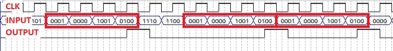
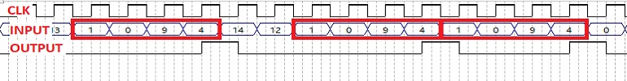
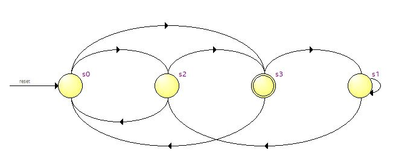
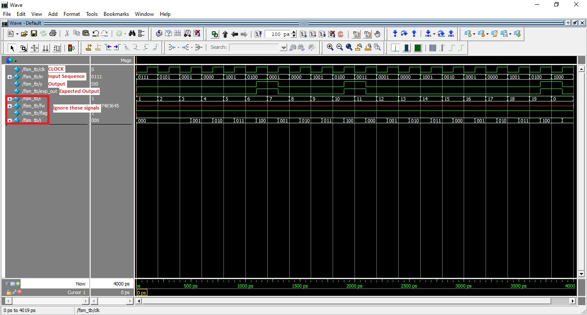

<!-- 

 -->

<!--  -->

<h1>Task 1 C : Finite State Machine </h1>

<b>Problem Statement :</b> Design a Finite State Machine in Verilog HDL to detect sequence/pattern <b>1094</b>, which is a sequence of four <b>decimal</b> numbers (1,0,9,4).

<b>Description :</b>
  In this task you will be designing a Finite State Machine (Sequence/Pattern Detector) using Verilog HDL to detect sequence 1094. The input to your design will be any random stream of <b>decimal</b> numbers from <b>0-9</b> (Eg: 1830249754810). You’ll design a FSM which detects the pattern <b>1094</b>, whenever this pattern is detected the output becomes HIGH. Step by step procedure is discussed below.

> *__Important__ : Your FSM design should work on the positive edge of the clock as shown in the below images.*  

  

  

> *__Note__ : You are only allowed to modify the code/ block diagram wherever it is mentioned to do so. Modifying the restricted blocks of code/ block diagram will result in **Zero Marks** and/ or **disqualification** from the competition.*

Project File : <u><a href="./project_files/fsm.zip" download>Download TASK 1 C</a></u>

<b>Resources :</b> <a name = "Resources1">
<ul>
 <li><u><a href="https://www.tutorialspoint.com/digital_circuits/digital_circuits_finite_state_machines.htm" target="_blank">Mealy and Moore State Machine</a></u></li>
</ul>

***

<b>Steps :</b>  

<ol>
<li>
Open fsm.qpf (Quartus Prime Project File) located in the fsm folder. Quartus Prime might take some time to load depending on the configuration of your PC.
</li> 
<li>
You will find the fsm.v Verilog HDL file already added to the project.
</li>

> *__Note__ : This file is pre-added to the project by the e-Yantra team.*

<li>
Double click on it to edit. You’ll find prewritten code where the module is defined. Edit this file to design the required State Machine. Use Verilog case statement to design and write your code such that Quartus Generates a State Machine. For that, you will have to properly declare State Variables of the State Machine and also perform State Assignments correctly.
</li>
<li>
Compile your design. <b>Processing > Start Compilation.</b>
</li>
<li>
Now you can view a graphical representation of your designed State Machine in Quartus. <b>Tools > Netlist Viewers > State Machine Viewer.</b>
</li>

   

> *__Note__ : The above State Machine is not for detecting the sequence 1094. Also, this graphical State Machine will be generated in Quartus only if your Verilog HDL code is written in a way that Quartus understands it as a State Machine.*

<li>
You can compare the State Machine which Quartus generated and the self designed State Machine. You can edit your Verilog code and repeat the above steps till the desired State Machine is generated.
</li>

<li>
Finally Run the RTL simulation. <b>Tools > Run Simulation Tool > RTL Simulation</b>. A new window will pop up after a few seconds and you will be able to see the results of your design in ModelSim Software. If your design is correct then you will see a <b>Congratulations</b> message in the transcript. Else you will see an <b>Error</b> message in the transcript.
</li>

<li>
You can also check waveforms and verify/debug your design.
</li>

   

When <b>Output(Y)</b> and <b>Expected Output(exp_out)</b> match, there will be no errors in the design.

</ol>

 

<b>…BestWishes!…</b>
