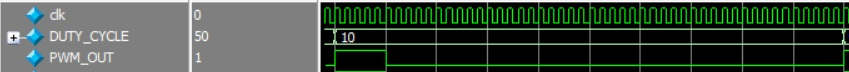
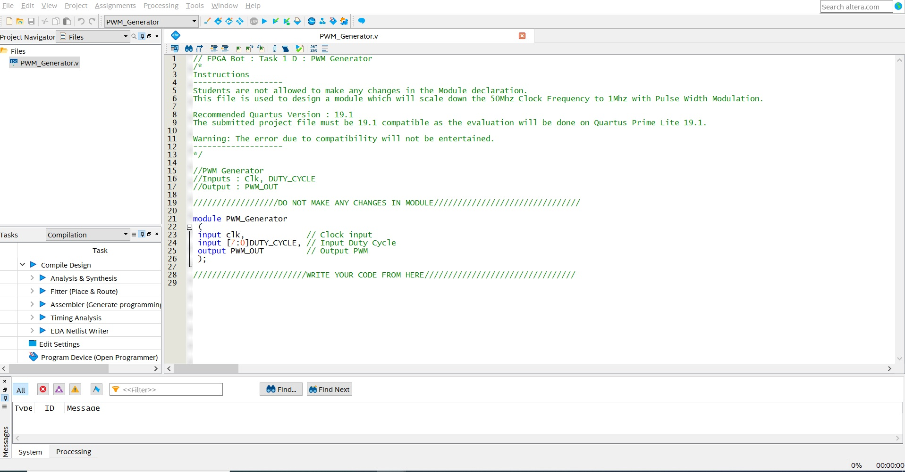

<!-- 

 -->

<!--  -->

<h1>Task 1 D : Frequency Scaling and Pulse Width Modulation </h1>

<b>Problem Statement :</b> To scale down the 50Mhz Clock Frequency to 1Mhz and implement Pulse Width Modulation on it.

<b>Description :</b>
  In this task you will be designing a Frequency Scaling and Pulse Width Modulation block which has a 50Mhz clock and 8-bit Duty cycle as inputs. It has one <b>single output</b> which can generate a <b>variable duty cycle pulse width modulated signal with frequency of 1Mhz. </b>

E.g.   
Input clk = 50Mhz
Input Duty Cycle = 50%
Output : 

  

Input clk = 50Mhz
Input Duty Cycle = 10%
Output : 

  

Project File : <u><a href="./project_files/PWM.zip" download>Download TASK 1 D</a></u>

<b>Resources :</b> <a name = "Resources1">
<ul>
 <li><u><a href="https://www.analogictips.com/pulse-width-modulation-pwm/" target="_blank">PWM</a></u></li>
 <li><u><a href="https://www.youtube.com/watch?v=2XjqS1clY_E" target="_blank">What is Pulse Width Modulation</a></u></li>
 <li><u><a href="https://www.youtube.com/watch?v=5nwNKPs2gco" target="_blank">How PWM Works</a></u></li>
 <li><u><a href="https://www.seeedstudio.com/blog/2020/06/16/basic-electronics-pulse-width-modulationpwm-and-arduino-applications/" target="_blank">PWM Applications</a></u></li>
 
</ul>

***

<b>Steps :</b>  

<ol>
<li>
Open the project file PWM_Generator.qpf which you have already downloaded from the above given link.
</li> 
<li>
You will find the PWM_Generator.v Verilog HDL file already added to the project.
</li>

  

<li>
Double click on it to edit. You’ll find prewritten code where the module is defined. Read the comments provided in the PWM_Generator.v file properly. Edit this file to design a  Frequency Scaling and Pulse Width Modulation module. 
</li>

  

<b>Hint : </b>
<ol>
<li>First think how the input frequency of 50 Mhz can be scaled down to 1Mhz. (Think of a counter that can be used to achieve the desired output frequency).</li>
<li>Duty cycle is 8 bit and it can have values between 0 - 100%. Think how this percentage input can be related to the on/off time of the signal generated in hint 1.</li>
<li>To summarize, you are required to generate a PWM signal with variable duty cycle and output it on <b>PWM_OUT</b> signal. Use the <b>DUTY_CYCLE</b> input to vary the duty cycle (consider this as a variable whose value will be given externally). This PWM_OUT signal should be of <b>1MHz</b> frequency.</li>
</ol>

> *__Note__ : The duty cycle will have value with a step size of 10% for simplicity in this task.* 

<li>
Once you are done writing the verilog code. Compile your design. <b>Processing > Start Compilation.</b>
</li>
<li>
Once you are done with the compilation with no error, proceed with the RTL simulation.
</li>
<li>
If your design is correct you will see a <b>congratulation your design works fine</b> message at the transcript window. Else you will see an Error message in the transcript.
</li>
<li>
You can also check waveforms and verify/debug your design.
</li>

  

> *__Note__ : Team can also use the .vwf technique to debug the code. But final code should simulate on modelsim with a proper transcript message i.e: Congratulations your design works fine.*

<b>…BestWishes!…</b>
